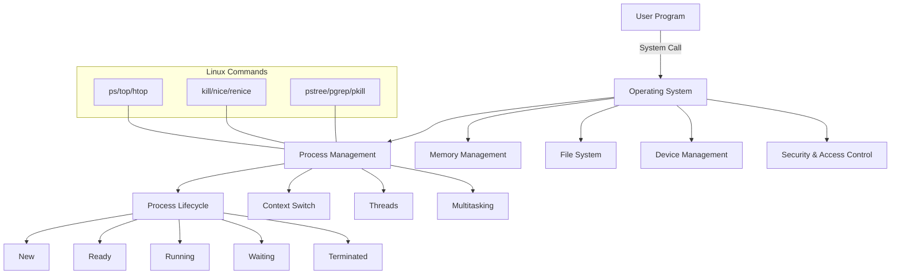

# Operating System Concepts: Visual Overview

---

# Operating Systems and Processes: Deep, Simple Notes

## 1. What is an Operating System (OS)?

Imagine your computer is like a busy restaurant. The OS is the manager:
- It makes sure every order (program) gets what it needs (CPU, memory, files).
- It keeps the kitchen (hardware) running smoothly.
- It prevents fights (crashes) between customers (programs).

**In simple words:**
An OS is the main software that controls your computer’s hardware and lets you run programs. Examples: Windows, Linux, macOS.

### Why do we need an OS?
- Without an OS, you’d have to control the hardware yourself (impossible for most people!).
- The OS makes computers usable for everyone.

---

## 2. What is a Process?

**Analogy:**
Think of a process as a chef in the restaurant. Each chef (process) is working on their own dish (program), using their own ingredients (memory, files).

**Definition:**
A process is a running program. It has its own memory, data, and resources.

**Beginner mistake:**
Confusing a program (recipe) with a process (chef cooking the recipe).

---

## 3. Process Lifecycle (Step-by-Step)

1. **New:** The process is being created.
2. **Ready:** Waiting for CPU time.
3. **Running:** Actively using the CPU.
4. **Waiting:** Waiting for something (like data from disk).
5. **Terminated:** Finished and cleaned up.

**Debugging tip:**
If a program “hangs,” it might be stuck in the Waiting state.

---

## 4. Context Switching (Real-World Example)

**Analogy:**
Imagine the kitchen has only one stove (CPU). The manager (OS) tells Chef A to pause, saves their work, and lets Chef B use the stove. Later, Chef A resumes exactly where they left off.

**Definition:**
Context switching is when the OS saves the state of one process and loads another. This lets many programs “run at once.”

**Common mistake:**
Thinking the CPU runs all programs at the same time. Actually, it switches between them very fast.

---

## 5. Threads (Simple Explanation)

**Analogy:**
If a process is a chef, threads are the chef’s hands. One chef (process) can use both hands (threads) to work faster on the same dish.

**Definition:**
Threads are smaller units of work inside a process. They share memory but can do different tasks at once.

**Real-world example:**
A web browser loading a page and playing a video at the same time uses threads.

---

## 6. Multitasking (How Computers “Do Many Things”)

**Analogy:**
The manager (OS) quickly switches the stove between chefs (processes), so it looks like everyone is cooking at once.

**Types:**
- Preemptive: The OS decides when to switch.
- Cooperative: Each process decides when to give up control (rare today).

**Debugging scenario:**
If your computer is slow, too many processes may be fighting for the CPU.

---

## 7. System Calls (How Programs Talk to the OS)

**Analogy:**
Chefs (programs) ask the manager (OS) for help: “Give me a pan!” (open a file), “Turn on the stove!” (use CPU).

**Definition:**
System calls are special requests from programs to the OS. Examples: fork(), exec(), wait(), read(), write().

**Beginner mistake:**
Trying to access hardware directly instead of using system calls.

---

## 8. Linux Process Commands (Practice)

- `ps`: List processes
- `top`/`htop`: Live process monitor
- `kill`: Stop a process
- `nice`/`renice`: Change process priority
- `pstree`: Show process tree
- `pgrep`/`pkill`: Find/kill by name

**Mini Test:**
1. What’s the difference between a process and a thread?
2. What is context switching?
3. Name two Linux commands to see running processes.

---

## 9. Common Beginner Mistakes

- Confusing programs with processes
- Forgetting to use system calls
- Not understanding why a process is “stuck” (usually waiting for something)
- Not checking process priorities (can cause slowdowns)

---

## 10. Real-World Debugging Example

**Scenario:**
Your program is slow. You run `top` and see it’s “waiting for I/O.” This means it’s not using the CPU, but waiting for data from disk or network. Solution: Check disk/network speed, not just CPU.

---

## 11. Problem-Solving Thinking

When something goes wrong:
1. Is the process running or waiting?
2. Is it using too much CPU or memory?
3. Are there too many processes?
4. Is it a thread issue (deadlock, race condition)?

---

## 12. Exercises

Try the exercises in the exercises.md file to test your understanding!
